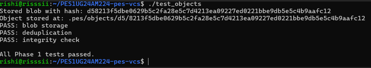
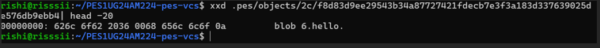
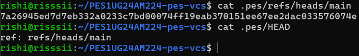

# OS Orange - 2

**Name:** Rishi J Mule  
**SRN:** PES1UG24AM224  
**Section:** D  

---

## Screenshot 1A: test_objects output showing all tests passing


## Screenshot 1B: Sharded object directory structure using find .pes/objects -type f


## Screenshot 2A: test_tree output showing all tests passing


## Screenshot 2B: Raw binary tree object inspected using xxd


## Screenshot 3A: pes init → pes add → pes status command sequence


## Screenshot 3B: cat .pes/index showing text-format staging area


## Screenshot 4A: pes log showing three commits with hashes, authors and timestamps


## Screenshot 4B: find .pes -type f showing object store growth after three commits


## Screenshot 4C: cat .pes/refs/heads/main and cat .pes/HEAD showing reference chain


## Final Test


---

## Questions and Answers

### Q5.1 — How would you implement `pes checkout <branch>`?

To implement `pes checkout`, update `.pes/HEAD` to:

```
ref: refs/heads/<branchname>
```

Then:
- Read target commit → get tree  
- Traverse tree  
- Write files  
- Delete old files  

---

### Q5.2 — How would you detect a dirty working directory conflict?

- Compare mtime and size  
- Compare hash with target  

If modified + different → abort  

---

### Q5.3 — Detached HEAD

- HEAD points to commit  
- Commits not tracked  

Fix:
- Create branch  

---

### Q6.1 — Delete unreachable objects

Mark:
- traverse refs → commits → trees  

Sweep:
- delete unreferenced  

---

### Q6.2 — GC danger

- blobs written first  
- GC may delete  

Git avoids via:
- grace period  
- locks  
