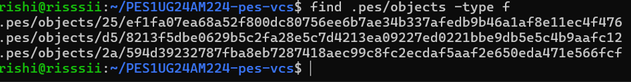
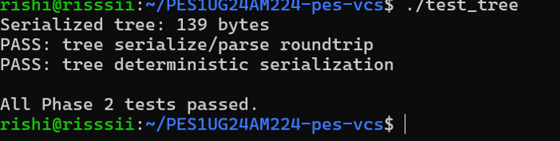
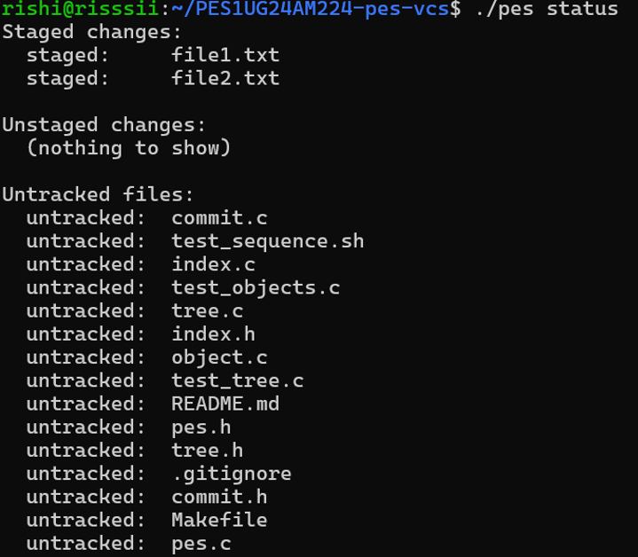
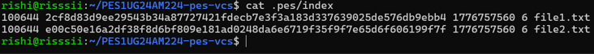
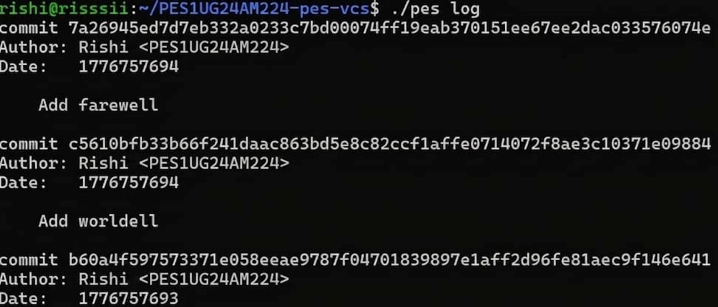
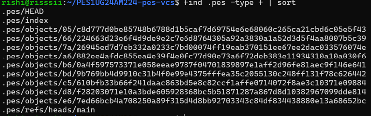
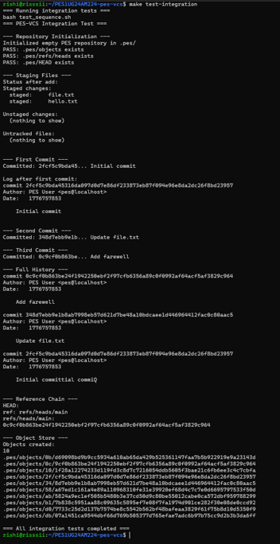

# OS Orange - 2

**Name:** Rishi J Mule  
**SRN:** PES1UG24AM224  
**Section:** D  

---

## Screenshot 1A: test_objects output showing all tests passing

## Screenshot 1B: Sharded object directory structure using find .pes/objects -type f

## Screenshot 2A: test_tree output showing all tests passing

## Screenshot 2B: Raw binary tree object inspected using xxd

## Screenshot 3A: pes init → pes add → pes status command sequence

## Screenshot 3B: cat .pes/index showing text-format staging area

## Screenshot 4A: pes log showing three commits with hashes, authors and timestamps

## Screenshot 4B: find .pes -type f showing object store growth after three commits

## Screenshot 4C: cat .pes/refs/heads/main and cat .pes/HEAD showing reference chain

## Final Test

---

## Questions and Answers

Q5.1 — How would you implement pes checkout <branch>?
To implement pes checkout, two things must happen: the .pes/ directory must be updated, and the working directory must be restored to match the target branch's snapshot.
For .pes/ changes, HEAD must be updated to contain "ref: refs/heads/branchname". If the branch is new, a file must be created at .pes/refs/heads/branchname containing the current commit hash.
For the working directory, the target branch's commit object is read to get its tree hash. That tree is recursively walked, and every blob is written to disk at its correct path. Files that existed in the old branch but are absent from the new branch must be deleted from disk.
What makes this complex is handling four problems simultaneously. First, a dirty working directory — if the user has unsaved modifications, checkout could silently overwrite them, so the operation must detect and refuse if conflicts exist. Second, recursive tree traversal — nested subdirectories must be created and populated correctly. Third, deletions — files present in the old tree but absent from the new one must be removed. Fourth, atomicity — if checkout fails halfway, the working directory is left in a broken state, so care must be taken to minimize that window.

Q5.2 — How would you detect a dirty working directory conflict using only the index and object store?
For each file tracked in the current index, the following check is performed:
First, stat the file on disk to get its current mtime and size. Compare these with the mtime and size stored in the index entry. If either differs, the file has been modified since it was last staged — this is the same fast metadata check Git uses to avoid re-hashing every file on every operation.
Second, read the target branch's commit object, get its tree, and find the blob hash for the same file path. Compare that hash with the hash stored in the current index entry.
If the file is both modified on disk and different between the two branches, checkout must refuse with an error such as "your local changes would be overwritten by checkout." If the file differs between branches but matches the index (the working copy is clean), checkout can safely overwrite it. This two-step check using mtime, size, and hash allows conflict detection without reading every file's full contents.

Q5.3 — What happens if you make commits in detached HEAD state, and how do you recover?
Detached HEAD means .pes/HEAD contains a raw commit hash directly instead of a branch reference like "ref: refs/heads/main". This happens when you checkout a specific commit rather than a branch name.
If commits are made in this state, they are created correctly and linked via parent pointers as normal. However, no branch ref is updated to track them. The moment you checkout a different branch, HEAD moves away and those commits become unreachable — nothing in .pes/refs/ points to them anymore, so they are invisible to pes log and would be deleted by garbage collection.
To recover, if you have not yet switched away, immediately create a new branch at the current position by writing the current HEAD hash into a new file under .pes/refs/heads/. This anchors the commit chain to a named branch. If you have already switched away, you need to know the lost commit hash — in real Git this is possible because Git maintains a reflog at .git/logs/HEAD that records every position HEAD has ever pointed to. Without a reflog, recovery requires remembering the hash or finding it in terminal history. Once the hash is known, a new branch file is created pointing to it, making the chain reachable again.

Q6.1 — Describe an algorithm to find and delete unreachable objects. What data structure would you use, and how many objects would you visit for 100,000 commits across 50 branches?
The algorithm follows a classic mark-and-sweep approach in two phases.
In the mark phase, every reachable object is identified. Starting from all branch refs in .pes/refs/heads/ and HEAD, each commit hash is added to a reachable set. Each commit object is read to extract its tree hash, which is also added. The tree is recursively walked — every sub-tree and blob hash encountered is added to the set. The commit's parent pointer is then followed and the process repeats until a commit with no parent is reached.
In the sweep phase, every file under .pes/objects/ is visited using directory traversal. For each file, its hash is reconstructed from the path (first two characters form the shard directory, the rest is the filename). If the hash is not present in the reachable set, the file is deleted.
The best data structure for the reachable set is a hash table keyed on the 32-byte ObjectID, giving O(1) insertion and lookup. A sorted array with binary search is a simpler alternative at O(log n) per lookup.
For the estimate: with 100,000 commits and an average of around 25 objects per commit (one commit object, one root tree, several sub-trees, and roughly 15 to 20 blobs), approximately 2.5 million objects would need to be visited during the mark phase. The sweep phase then reads the entire .pes/objects/ directory listing, which could be similarly large. Total cost is roughly 2 to 5 million file operations for a repository of that size.

Q6.2 — Why is it dangerous to run GC concurrently with a commit? Describe the race condition and how Git avoids it.
The danger arises from a window during commit creation where new objects exist in the store but are not yet referenced by any branch or tag.
The race condition unfolds as follows. A commit operation calls tree_from_index and writes several blob objects to the object store. At this moment the blobs are stored on disk but no commit object or tree object points to them yet — they appear unreachable to any outside observer. Concurrently, GC starts its mark phase, scans all branch refs, and walks all reachable objects. It does not see the new blobs because the commit has not been written yet. GC's sweep phase then deletes those blobs as unreachable garbage. When the commit operation resumes and writes its tree and commit objects referencing the now-deleted blobs, the repository is corrupt — the objects those references point to no longer exist.
Git avoids this race through a grace period mechanism. Any loose object newer than a configurable threshold (defaulting to two weeks) is never deleted by GC regardless of whether it appears reachable. This ensures that any in-progress operation has ample time to complete and establish references before an object can be collected. Git also writes a lock file at .git/gc.pid to prevent multiple GC processes from running simultaneously, and it performs GC on loose objects only after they have existed long enough that no concurrent operation could be mid-way through referencing them.

